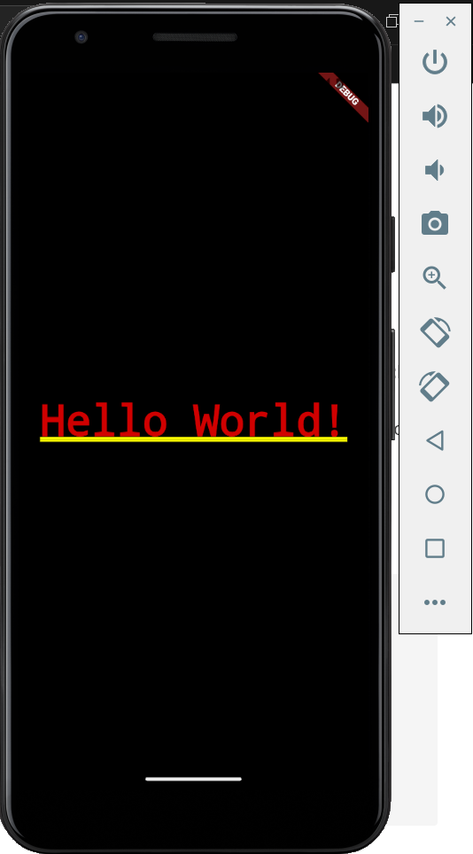
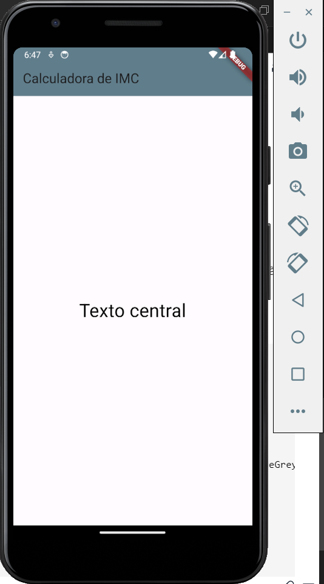

# Aula04 - Flutter
FLutter é um framework para criação de apps web e mobile que utiliza a linguagem dart
## main.dart
Arquivo principal de um aplicativo flutter<br>Para criar uma nova aplicação mobile:
- 1 Abra um emulador do Android Studio.
- 2 Crie uma pasta para o projeto
- 3 Abra a pasta com **VsCode** e abra o terminal com **CTRL + SHIFT + P** e clique em **flutter:New Project**
- 4 Escolha o tipo de projeto em branco ou algum modelo que prefira, escolha a pasta para criar o projeto e dê um nome.
- 5 Procure o arquivo **./lib/main.dart** e para iniciar no emulador pressione **F5**
- 6. Se quiser iniciar do **zero** limpe o arquivo e coloque o código a seguir:
- main.dart
```dart
import 'package:flutter/material.dart';

main() {
  runApp(const MaterialApp(
    home: Center(
      child: Text('Hello World!'),
    ),
  ));
}
```
- O resultado será um Olá Mundo.<br>

### Materiais Widget
Cada componente/ferramenta que utilizamos no flutter recebe esta classificação **Widget**, temos um grande volume de materiais no site **[material.io](https://m3.material.io/develop/flutter)**

- Alterando o app, utilizando o material **Scaffold**

```dart
import 'package:flutter/material.dart';

main() {
  runApp(MaterialApp(
    home: Scaffold(
      appBar: AppBar(
          title: Text('Calculadora de IMC'), backgroundColor: Colors.blueGrey),
      body: Center(
          child: Text('Texto central',
              style: TextStyle(fontSize: 30, color: Colors.black))),
    ),
  ));
}
```
