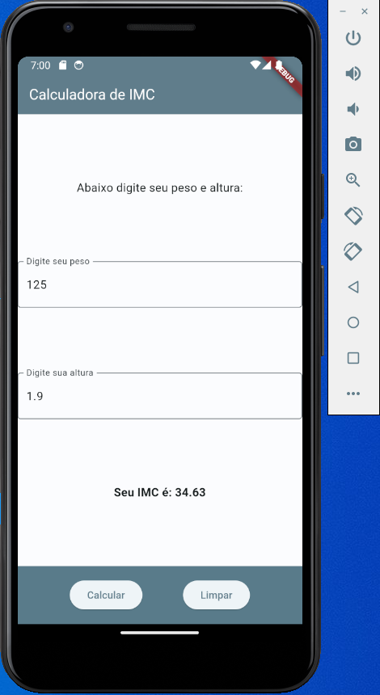

# Aula04 - Flutter - Introdução ao Ambiente
FLutter é um framework para criação de apps web e mobile que utiliza a linguagem dart
## main.dart
Arquivo principal de um aplicativo flutter<br>Para criar uma nova aplicação mobile:
- 1 Abra um emulador do Android Studio.
- 2 Crie uma pasta para o projeto
- 3 Abra a pasta com **VsCode** e abra o terminal com **CTRL + SHIFT + P** e clique em **flutter:New Project**
- 4 Escolha o tipo de projeto em branco ou algum modelo que prefira, escolha a pasta para criar o projeto e dê um nome.
- 5 Procure o arquivo **./lib/main.dart** e para iniciar no emulador pressione **F5**
- 6. Se quiser iniciar do **zero** limpe o arquivo e coloque o código a seguir:
- main.dart
```dart
import 'package:flutter/material.dart';

main() {
  runApp(const MaterialApp(
    home: Center(
      child: Text('Hello World!'),
    ),
  ));
}
```
- O resultado será um Olá Mundo.<br>

## Estados [Global, Local]
- StatelessWidget - São Widgets que não mudam seu estado
- StatefulWidget - São Widgets que mudam o estado
### Widget, Materiais
Cada componente/ferramenta que utilizamos no flutter recebe esta classificação **Widget**, temos um grande volume de materiais no site **[material.io](https://m3.material.io/develop/flutter)**

- Alterando o app, utilizando o material **Scaffold**

```dart
import 'package:flutter/material.dart';

main() {
  runApp(MaterialApp(
    home: Scaffold(
      appBar: AppBar(
          title: Text('Calculadora de IMC'), backgroundColor: Colors.blueGrey),
      body: Center(
          child: Text('Texto central',
              style: TextStyle(fontSize: 30, color: Colors.black))),
    ),
  ));
}
```


## Camadas arquitetônicas
Flutter foi projetado como um sistema extensível em camadas. Ele existe como uma série de bibliotecas independentes, cada uma dependendo da camada subjacente. Nenhuma camada tem acesso privilegiado à camada abaixo, e cada parte do nível da estrutura é projetada para ser opcional e substituível.


A seguir temos um exemplo com StateLessWidget passando o parâmetro título ao chamar a classe
```dart
import 'package:flutter/material.dart';

main() {
  runApp(const MyApp(title:'Calculadora de IMC'));
}

class MyApp extends StatelessWidget {
  final String? title;
  const MyApp({super.key, this.title});
  @override
  Widget build(BuildContext context) {
    return MaterialApp(
      home: Scaffold(
        appBar:
            AppBar(title: Text(this.title.toString()), backgroundColor: Colors.blueGrey),
        body: const Center(
            child: Text('Digite seu peso e sua altura:',
                style: TextStyle(fontSize: 30, color: Colors.black),)),
      ),
    );
  }
}
```

## Calculadora de IMC
O exemplo a seguir applica os conceitos de **state**/Estado, variáveis/Passagem de parâmetros, **Entrada, Processamento e Saída**, Widgets [Scaffold, Text, TextField, bottomNavigationBar, ElevatedButton]

```dart
// ignore_for_file: prefer_const_constructors

import 'package:flutter/material.dart';

void main() {
  runApp(const MyApp());
}

class MyApp extends StatelessWidget {
  const MyApp({super.key});

  @override
  Widget build(BuildContext context) {
    return MaterialApp(
      title: 'Calc IMC Flutter',
      theme: ThemeData(
        colorScheme: ColorScheme.fromSeed(
            seedColor: Colors.blueGrey,
            secondary: Colors.white,
            primary: Colors.blueGrey),
        useMaterial3: true,
      ),
      home: const MyHomePage(title: 'Calculadora de IMC'),
    );
  }
}

class MyHomePage extends StatefulWidget {
  const MyHomePage({super.key, required this.title});

  final String title;

  @override
  State<MyHomePage> createState() => _MyHomePageState();
}

class _MyHomePageState extends State<MyHomePage> {

  double peso = 0.0;
  double altura = 0.0;
  double imc = 0.0;
  String result = '';

  void _calculateIMC() {
    setState(() {
      imc = peso / (altura * altura);
      imc = double.parse(imc.toStringAsFixed(2));
      if (imc < 18.5) {
        result = 'Abaixo do peso';
      } else if (imc >= 18.5 && imc < 24.9) {
        result = 'Peso normal';
      } else if (imc >= 25 && imc < 29.9) {
        result = 'Sobrepeso';
      } else if (imc >= 30 && imc < 34.9) {
        result = 'Obesidade grau 1';
      } else if (imc >= 35 && imc < 39.9) {
        result = 'Obesidade grau 2';
      } else {
        result = 'Obesidade grau 3';
      }
    });
  }

  void _clearFields() {
    setState(() {
      peso = 0.0;
      altura = 0.0;
      imc = 0.0;
    });
  }

  @override
  Widget build(BuildContext context) {
    return Scaffold(
      appBar: AppBar(
        backgroundColor: Theme.of(context).colorScheme.primary,
        title: Text(widget.title),
        titleTextStyle: TextStyle(
            color: Theme.of(context).colorScheme.secondary, fontSize: 20),
      ),
      body: Center(
        child: Column(
          mainAxisAlignment: MainAxisAlignment.spaceEvenly,
          children: <Widget>[
            const Text(
              'Abaixo digite seu peso e altura:',
              style: TextStyle(fontSize: 16),
            ),
            TextField(
              decoration: InputDecoration(
                border: OutlineInputBorder(),
                labelText: 'Digite seu peso',
              ),
              onChanged: (text) {
                peso = double.parse(text);
              },
            ),
            TextField(
              decoration: InputDecoration(
                border: OutlineInputBorder(),
                labelText: 'Digite sua altura',
              ),
              onChanged: (text) {
                altura = double.parse(text);
              },
            ),
            Text(
              'Seu IMC é: $imc \n $result',
              style: TextStyle(fontSize: 16, fontWeight: FontWeight.bold),
            ),
          ],
        ),
      ),
      bottomNavigationBar: BottomAppBar(
        color: Theme.of(context).colorScheme.primary,
        child: Row(
          mainAxisAlignment: MainAxisAlignment.spaceEvenly,
          children: <Widget>[
            ElevatedButton(
              onPressed: _calculateIMC,
              child: const Text('Calcular'),
            ),
            ElevatedButton(
              onPressed: _clearFields,
              child: const Text('Limpar'),
            ),
          ],
        ),
      ),
    );
  }
}
```
- Resultado
