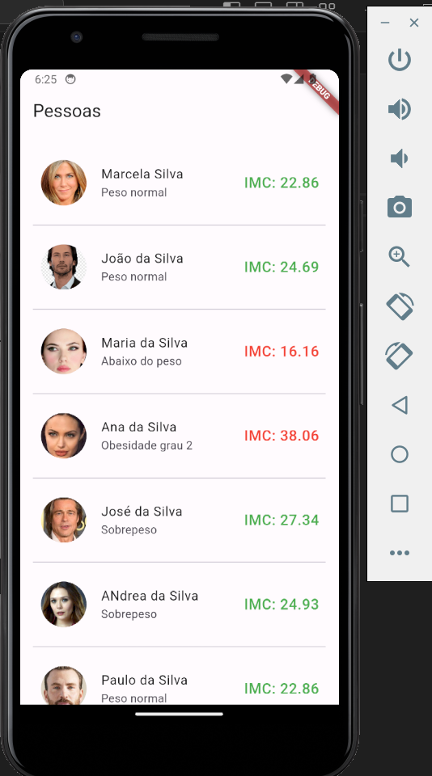
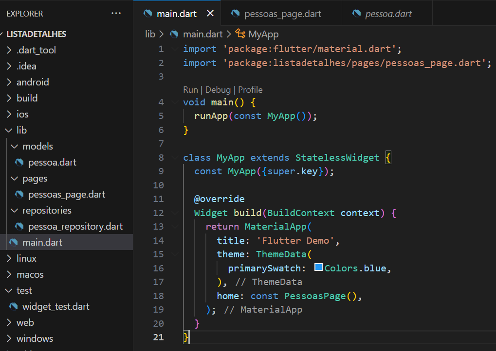

# Aula06 - ListView.separated
Nesta aula criaremos uma lista de pessoas com alguns dados como nome, foto, e dados numéricos como peso e altura
- Listas na vertical

<br>Este aplicativo ficará dividido em diretórios pra melhor controle dos dados no futuro, consumindo dados de uma API, Firebase ou Arquivos XML, JSON<br>

- Pasta **pages** onde ficaram as principais telas
- Pasta **models** onde ficam as classes estruturais
- Pasta **repositories** com arquivos para conexão a dados externos ou internos como neste exemplo.
- Arquivo **main.dart** contendo o ponto inicial do App.

## Codigos das páginas
- main.dart
```dart
import 'package:flutter/material.dart';
import 'package:listadetalhes/pages/pessoas_page.dart';

void main() {
  runApp(const MyApp());
}

class MyApp extends StatelessWidget {
  const MyApp({super.key});

  @override
  Widget build(BuildContext context) {
    return MaterialApp(
      title: 'Flutter Demo',
      theme: ThemeData(
        primarySwatch: Colors.blue,
      ),
      home: const PessoasPage(),
    );
  }
}
```
- ./pages/pessoas_page.dart
```dart
import 'package:flutter/material.dart';
import 'package:listadetalhes/repositories/pessoa_repository.dart';

class PessoasPage extends StatelessWidget {
  const PessoasPage({super.key});

  @override
  Widget build(BuildContext context) {
    final tabela = PessoaRepository.tabela;
    return Scaffold(
        appBar: AppBar(
          title: const Text('Pessoas'),
        ),
        body: ListView.separated(
            itemBuilder: (BuildContext context, int indice) {
              return ListTile(
                leading: CircleAvatar(
                  backgroundImage:
                      Image.network(tabela[indice].avatar.toString()).image,
                      radius: 30,
                ),
                contentPadding: const EdgeInsets.all(8),
                title: Text(tabela[indice].nome),
                subtitle: Text(tabela[indice].diagnostico()),
                trailing:
                    Text('IMC: ${tabela[indice].imc().toStringAsFixed(2)}', 
                    style: TextStyle(
                      color: tabela[indice].imc() < 18.5 || tabela[indice].imc() > 29.9? Colors.red : Colors.green,
                      fontSize: 18,
                    ),),
              );
            },
            padding: const EdgeInsets.all(16),
            separatorBuilder: (_, ___) => const Divider(),
            itemCount: tabela.length));
  }
}
```
- ./models/pessoa.dart
```dart
iclass Pessoa {
  String nome;
  int idade;
  double altura;
  double peso;
  String? avatar;

  Pessoa(this.nome, this.idade, this.altura, this.peso, [this.avatar]);

  double imc() {
    return peso / (altura * altura);
  }

  String diagnostico() {
    if (imc() < 18.5) {
      return 'Abaixo do peso';
    } else if (imc() < 24.9) {
      return 'Peso normal';
    } else if (imc() < 29.9) {
      return 'Sobrepeso';
    } else if (imc() < 34.9) {
      return 'Obesidade grau 1';
    } else if (imc() < 39.9) {
      return 'Obesidade grau 2';
    } else {
      return 'Obesidade grau 3';
    }
  }

  String toJSON() {
    return '''
    {
      "nome": "$nome",
      "idade": $idade,
      "altura": $altura,
      "peso": $peso,
      "avatar": "$avatar"
    }
    ''';
  }
}
```
- ./repositories/pessoa_repository.dart
```dart
import 'package:listadetalhes/models/pessoa.dart';

class PessoaRepository {
  static List<Pessoa> tabela = [
    Pessoa('Marcela Silva', 44, 1.75, 70.0,'https://raw.githubusercontent.com/wellifabio/senai2023/main/2des/projetos/assets/avatares/cli1.png'),
    Pessoa('João da Silva', 33, 1.80, 80.0,'https://raw.githubusercontent.com/wellifabio/senai2023/main/2des/projetos/assets/avatares/cli2.png'),
    Pessoa('Maria da Silva', 22, 1.65, 44.0,'https://raw.githubusercontent.com/wellifabio/senai2023/main/2des/projetos/assets/avatares/cli3.png'),
    Pessoa('Ana da Silva', 55, 1.70, 110.0,'https://raw.githubusercontent.com/wellifabio/senai2023/main/2des/projetos/assets/avatares/cli4.png'),
    Pessoa('José da Silva', 66, 1.60, 70.0,'https://raw.githubusercontent.com/wellifabio/senai2023/main/2des/projetos/assets/avatares/cli5.png'),
    Pessoa('ANdrea da Silva', 77, 1.90, 90.0,'https://raw.githubusercontent.com/wellifabio/senai2023/main/2des/projetos/assets/avatares/cli6.png'),
    Pessoa('Paulo da Silva', 88, 1.75, 70.0,'https://raw.githubusercontent.com/wellifabio/senai2023/main/2des/projetos/assets/avatares/cli7.png'),
    Pessoa('Mariana da Silva', 99, 1.75, 70.0,'https://raw.githubusercontent.com/wellifabio/senai2023/main/2des/projetos/assets/avatares/cli8.png'),
  ];

  void add(Pessoa pessoa) {
    tabela.add(pessoa);
  }

  void remove(Pessoa pessoa) {
    tabela.remove(pessoa);
  }

  List<Pessoa> get pessoas => tabela;
}
```
Esta lista é estática e as imagens estão remotas, acessadas através da URL.

## Atividades
Vamos replicar este aplicativo e criar outro como exercício com uma lista de produtos, animais ou plantas, use sua criatividade para escolher o tema.

# Aicionando interatividade a Lista
Agora, vamos marcar em uma sublista os itens selecionados através de um longPress, para isso vamos voltar a trabalhar com os **estados** e o tipo da página passa a ser **StatefulWidget**<br>[Créditos: Assista esta vídeo aula no youtube](https://youtu.be/6aehTIdBnyQ?si=g7ZZaDHepd5TDbnx)

- ./pages/pessoas_page.dart
```dart
import 'package:flutter/material.dart';
import 'package:listadetalhes/models/pessoa.dart';
import 'package:listadetalhes/repositories/pessoa_repository.dart';

class PessoasPage extends StatefulWidget {
  const PessoasPage({super.key});

  @override
  State<PessoasPage> createState() => _PessoasPageState();
}

class _PessoasPageState extends State<PessoasPage> {
  @override
  Widget build(BuildContext context) {
    final tabela = PessoaRepository.tabela;
    List<Pessoa> selecionadas = [];

    return Scaffold(
        appBar: AppBar(
          title: const Text('Pessoas'),
        ),
        body: ListView.separated(
            itemBuilder: (BuildContext context, int indice) {
              return ListTile(
                leading: CircleAvatar(
                  backgroundImage:
                      Image.network(tabela[indice].avatar.toString()).image,
                  radius: 30,
                ),
                contentPadding: const EdgeInsets.all(8),
                title: Text(tabela[indice].nome),
                subtitle: Text(tabela[indice].diagnostico()),
                trailing: Text(
                  'IMC: ${tabela[indice].imc().toStringAsFixed(2)}',
                  style: TextStyle(
                    color: tabela[indice].imc() < 18.5 ||
                            tabela[indice].imc() > 29.9
                        ? Colors.red
                        : Colors.green,
                    fontSize: 18,
                  ),
                ),
                selected: selecionadas.contains(tabela[indice]),
                selectedTileColor: Colors.yellow[100],
                shape: RoundedRectangleBorder(
                  borderRadius: BorderRadius.circular(20),
                ),
                onLongPress: () => {
                  setState(() {
                    selecionadas.contains(tabela[indice])
                        ? selecionadas.remove(tabela[indice])
                        : selecionadas.add(tabela[indice]);
                  })
                },
              );
            },
            padding: const EdgeInsets.all(16),
            separatorBuilder: (_, ___) => const Divider(),
            itemCount: tabela.length));
  }
}

```